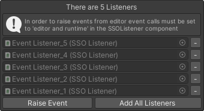
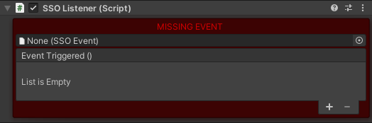
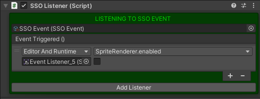

# **📢 SSO Events**
A scriptable object based event architecture.

 

# **📑 Contents**
[**Installation**](#installation) - [**Events**](#events) - [**Listeners**](#💡-listeners)

 

## **💾 Installation**

1. On your Unity project click `window -> package manager`
2. With the package manager open click on the `+` on the top left corner
3. Click on  `Add package from Git URL`
4. On GitHub, Click `Code -> HTTPS`, copy the URL and paste it on Unity

 

## **📣 Events**
---
Events are Scriptable Objects that can be created by right clicking in the asset folder.

`Create -> SSO -> Events -> New Event`

> 

You can visualize each subscribed `SSO Listener` and raise events directly from editor.
The `- button` allows you to unsubscribe the relative gameobject.

 

## **💡 Listeners**
---
Listeners are MonoBehaviours that will react when a SSO Event is raised.

In order to use them you need to add a `SSO Listener` Component to your gameobject.
once added, you can select the `SSO Event` you want this GameObject to listen to and trigger the `Unity Event` in it's component.

> 

You can raise events in the editor as long and you have `Editor and Runtime` selected in the component.

> 